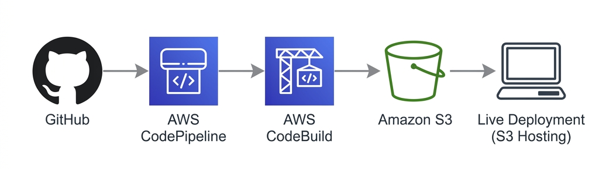

## aws-simple-cicd-practice

A simple static web application that demonstrates a basic CI/CD pipeline using AWS services. The project displays data from a dummy JSON file and automatically deploys updates to an Amazon S3-hosted website through AWS CodePipeline and CodeBuild.

## Pipeline Architecture

This project implements a fully automated "Push-to-Live" workflow:

1.  **Source (GitHub)**: The process begins when code is pushed to the GitHub repository.
2.  **Orchestration (AWS CodePipeline)**: A webhook triggers the pipeline, which coordinates the stages of the workflow.
3.  **Build (AWS CodeBuild)**: The system pulls the source code and uses the `buildspec.yml` configuration to package the application.
4.  **Storage & Deployment (Amazon S3)**: The final artifacts are uploaded to an S3 bucket configured for static website hosting.
5.  **Live Deployment**: S3 serves the files (HTML/CSS/JS) to visitors globally via its static web hosting endpoint.

### Tech Stack

*   **Frontend**: HTML5, Vanilla CSS, Javascript
*   **Infrastructure**: AWS S3 (Hosting), AWS CodePipeline (CI/CD), AWS CodeBuild (Build)

### Key Features

*   **Serverless**: No servers to manage (fully handled by S3).
*   **Automated**: Every git push triggers an immediate deployment.
*   **Minimalist**: Designed for learning AWS DevOps fundamentals with zero backend complexity.

### Purpose

This repository is intended for learning and practicing AWS CI/CD concepts using a lightweight static website, making it easy to understand the integration between services.

---
*Data was generated using [Mockaroo](https://mockaroo.com/) and the code was generated using **Google Antigravity IDE**.*
*All AWS resources like S3, pipeline was all deleted to prevent any cost incurred.*
*View documentation and test screenshots: [aws-simple-cicd-practice documentation](https://jeffjojerjonescatulay.github.io/project-docu-pages/aws-simple-cicd-practice/index.html)*
